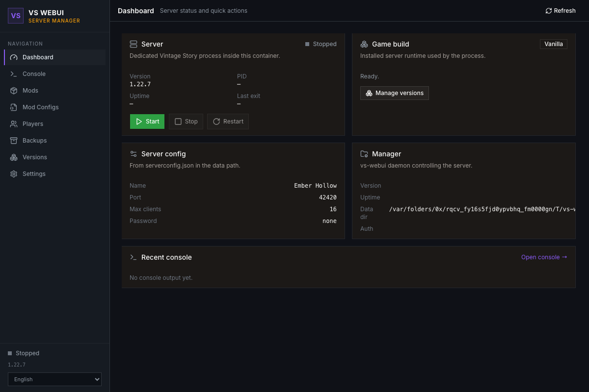
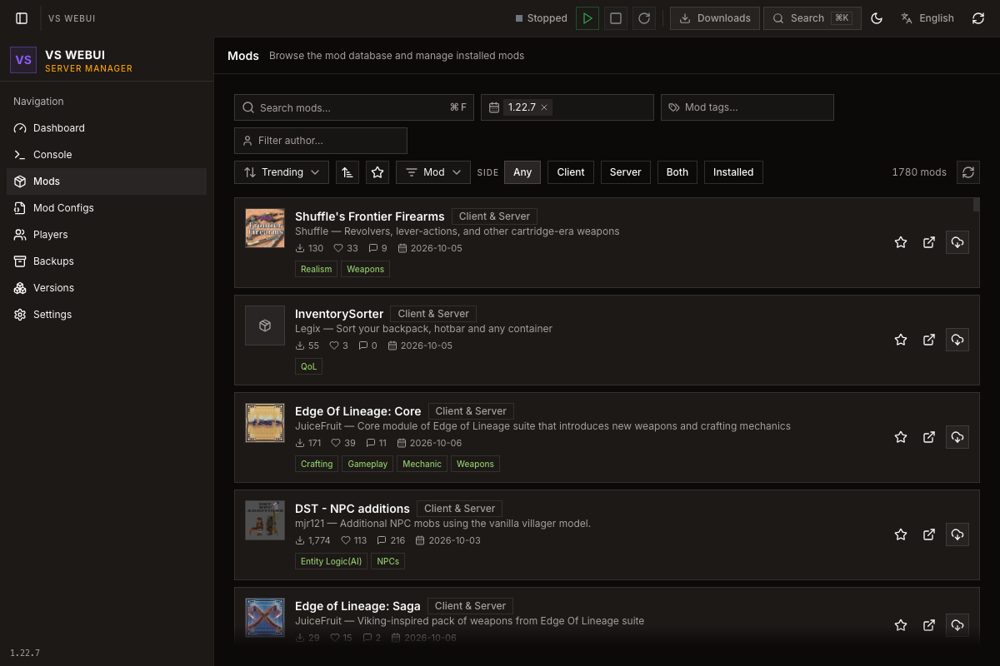
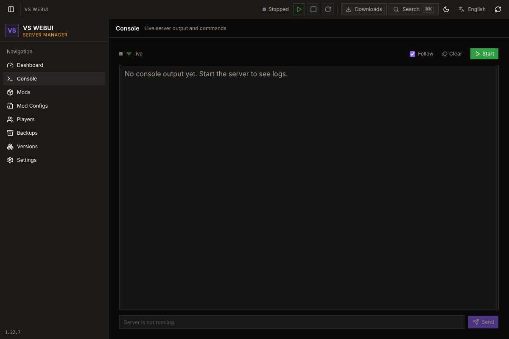
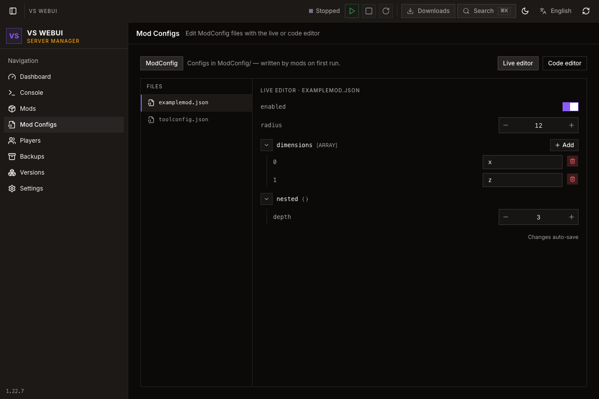
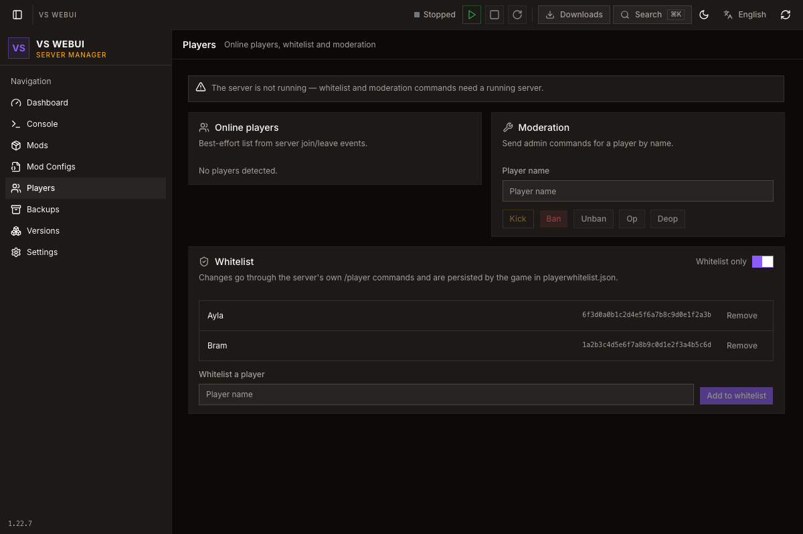
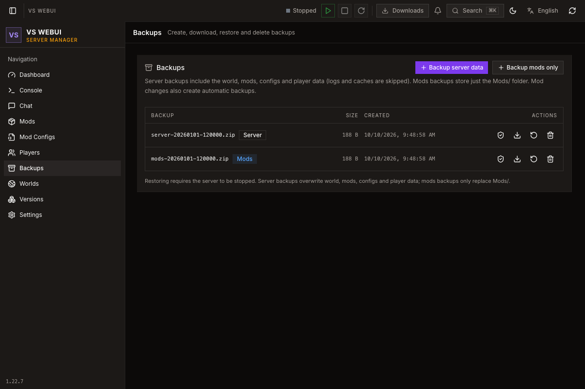

# vs-webui

**Vintage Story dedicated server in a single Docker container, managed through a
Story Forge-inspired web UI.**

Browse and update mods from the Mod Database, edit mod and server configs, watch the live
console, schedule backups and restarts, and run either the vanilla dedicated server or
[Stratum](https://stratumvs.dev) — the patched high-performance runtime.

[](https://github.com/LovelessCodes/vs-webui/actions/workflows/build.yml)
[](https://github.com/LovelessCodes/vs-webui/pkgs/container/vs-webui)
[](#requirements)
[](https://www.vintagestory.at/)
[](https://stratumvs.dev)

[](web/src/lib/i18n/locales)
[](LICENSE)
[](server)
[](web)
[](https://github.com/LovelessCodes/vs-webui/commits/main)
[](https://github.com/LovelessCodes/vs-webui/stargazers)

## Screenshots

| Dashboard | Mod browser | Console |
| :---: | :---: | :---: |
|  |  |  |

| Mod configs | Players | Backups |
| :---: | :---: | :---: |
|  |  |  |

All captures in [`web/screenshots/`](web/screenshots/) (English + `de/`), regenerated with
`bun run screenshots`.

## Features

- **Server control** — status chip, start/stop/restart and refresh in the app bar; live console
  over SSE with ANSI colors, output filter, log-file browser/download, command autocomplete and
  persistent history; **scheduled tasks** (cron-like restarts, backups and console commands with
  weekday filters, one-off runs, pre-restart backups, an explicit timezone and
  `5`/`1`-minute announcements).
- **Versions & runtimes** — install or switch any vanilla build from the official manifests
  (streaming download, MD5 verified); one-click [Stratum](https://stratumvs.dev) install/update
  with its three config editors and a `/stratum reload` action.
- **Mods** — full ModDB browser (search, game-version/tag/author/category/side filters,
  relevance/trending/downloads/… sorting, favorites) with dependency-aware installs,
  update-all, pins, a downloads sheet, automatic pre-change backups and missing-dependency
  banners.
- **Worlds** — creation wizard (seed, playstyle, world-generation overrides), duplicate/rename,
  upload/download, active-world switching and the creation-template settings editor.
- **Config editors** — `ModConfig/*.json` with a live form editor and a bundled Monaco editor
  (JSON5-safe), `serverconfig.json` as a form plus raw JSON, and the Stratum configs.
- **Players** — online list from join/leave events, whitelist read/write and moderation
  commands (kick, ban, op, …).
- **Backups** — manual and scheduled (daily `HH:MM`) server/mods backups, optional pre-restart
  and automatic pre-version/flavor-change backups, restore (stopped server only, or
  stop-restore-start in one action with a progress bar), CRC verification of every archive,
  count- and size-based retention, optional **offsite mirroring** to WebDAV or S3-compatible
  storage, download and configurable retention.
- **Users & access** — owner/operator/viewer accounts with per-user passwords (the first owner
  comes from `VS_WEB_PASSWORD`, or is generated on first boot and logged once), owner-only user
  management, read-only viewers, **optional TOTP two-factor** with one-time recovery codes,
  active-session management (revoke one or all), and an audit log of every mutating action with
  actor, method, status and origin; REST API with bearer **API tokens** (full or read-only).
- **Automation & monitoring** — **webhook notifications**
  (Discord, Slack or generic JSON) for start/stop/crash/join/leave/backup with crash log tails,
  **threshold alerts** for low tick rate, low disk space and failed scheduled backups, a
  persistent notification history in the bell menu, live CPU/memory/TPS sparklines on the
  dashboard and a **Prometheus** endpoint at `GET /metrics`.
- **7 languages** — English, German, Spanish, French, Brazilian Portuguese, Russian, Simplified
  Chinese, with a theme reveal transition and light/dark mode.

## Requirements

- Docker (or compatible runtime) on a **linux/amd64** host — the official Vintage Story server
  builds are x64 only.
- ~1 GB RAM for the manager plus whatever your world and player count need.

## Quick start

### docker compose (recommended)

```yaml
# compose.yaml
services:
  vs-webui:
    image: ghcr.io/lovelesscodes/vs-webui:latest
    container_name: vs-webui
    restart: unless-stopped
    stop_grace_period: 60s
    ports:
      - "42420:42420/tcp" # game clients (TCP)
      - "42420:42420/udp" # game clients (UDP)
      - "8080:8080"       # web UI
    environment:
      VS_WEB_PASSWORD: "change-me"
      PUID: "1000"
      PGID: "1000"
      # VS_AUTO_INSTALL: "true"
      # VS_AUTO_START: "true"
    volumes:
      - vs-data:/data
    healthcheck:
      test: ["CMD", "curl", "-fsS", "http://localhost:8080/api/health"]
      interval: 30s
      timeout: 5s
      start_period: 10s
      retries: 3

volumes:
  vs-data:
```

```sh
docker compose up -d
```

Check the container state with `docker compose ps` — it reports `healthy` once the manager
answers `GET /api/health`.

### docker run

```sh
docker run -d \
  --name vs-webui \
  --restart unless-stopped \
  --stop-timeout 60 \
  --health-cmd "curl -fsS http://localhost:8080/api/health || exit 1" \
  --health-interval 30s --health-timeout 5s --health-start-period 10s --health-retries 3 \
  -p 42420:42420/tcp -p 42420:42420/udp \
  -p 8080:8080 \
  -e VS_WEB_PASSWORD=change-me \
  -e PUID=1000 -e PGID=1000 \
  -v vs-data:/data \
  ghcr.io/lovelesscodes/vs-webui:latest
```

The image already carries the same `HEALTHCHECK`, so the explicit flags above are only needed
if you want to override the defaults. `docker ps` shows `(healthy)` once the manager answers
`GET /api/health`.

Open `http://localhost:8080` and log in as `admin` with `VS_WEB_PASSWORD` (or the password
generated on first boot and printed to the container logs). Add more accounts under
**Settings → Users**. Then install a game version under **Versions** and press **Start** in the
app bar. Game clients connect to `<host>:42420`.

## Ports

| Port | Protocol | Purpose |
| ---- | -------- | ------- |
| `42420` | TCP + UDP | Vintage Story game traffic |
| `8080` | TCP | Web UI + REST API + SSE |

## Environment

| Variable | Default | Description |
| -------- | ------- | ----------- |
| `VS_WEB_PASSWORD` | generated | Password for the first owner account; generated and logged once when no users exist yet |
| `VS_WEB_USERNAME` | `admin` | Name of that first owner account |
| `VS_WEB_AUTH` | `password` | `password` or `off` (use behind an authenticating reverse proxy) |
| `VS_WEB_PORT` | `8080` | Web UI port inside the container |
| `VS_DATA` | `/data` | Persistent data root (server files, worlds, mods, backups) |
| `VS_VERSION` | `latest` | Initial game version to install on first boot (`latest` or e.g. `1.22.7`) |
| `VS_AUTO_INSTALL` | `false` | Install the game version on first boot |
| `VS_AUTO_START` | `false` | Start the server when the manager boots |
| `VS_SECURE_COOKIE` | `false` | Set `Secure` on the session cookie (HTTPS deployments) |
| `PUID` / `PGID` | `1000` | Host user/group the server runs as; `/data` is re-owned on start |

The image ships a `HEALTHCHECK` against `GET /api/health` (30 s interval), so `docker ps`
reports the container as unhealthy if the manager stops answering. `PUID`/`PGID` are applied by
remapping the internal `vs` user at start-up; running the container with `--user` skips the
remap and runs directly.

## Data layout

```
/data
  config/                manager settings, users, sessions, API tokens, audit log
  runtime/
    vanilla/<version>/   installed vanilla server builds
    stratum/<tag>/       installed Stratum builds
  server/                data path: serverconfig.json, Mods/, ModConfig/, Saves/, Logs/
  backups/               server- and mods- backups (manual + scheduled)
```

## Automation & monitoring

### API tokens

Create one under **Settings → API tokens** (shown once, revocable, stored hashed) with a
**full** or **read-only** scope. Send it as a bearer token — no cookies or CSRF handling
required:

```sh
TOKEN=vsw_…
BASE=http://localhost:8080

curl -H "Authorization: Bearer $TOKEN" -X POST $BASE/api/server/start
curl -H "Authorization: Bearer $TOKEN" -X POST $BASE/api/server/restart
curl -H "Authorization: Bearer $TOKEN" -H "Content-Type: application/json" \
     -d '{"kind":"server"}' $BASE/api/backups
curl -H "Authorization: Bearer $TOKEN" $BASE/api/status
```

### Prometheus

`GET /metrics` exposes `vs_webui_server_running`, `vs_webui_server_cpu_percent`,
`vs_webui_server_memory_bytes` and `vs_webui_server_tps` (parsed from the server's `/stats`,
toggle under **Settings**; the probe output is hidden from the web console, though the game's own
`server-main.txt` still contains it). Scrape config with a token:

```yaml
scrape_configs:
  - job_name: vs-webui
    authorization:
      credentials: vsw_…
    static_configs:
      - targets: ["vs-webui:8080"]
```

### Webhooks

Configure a URL and event selection under **Settings → Notifications**; Discord and Slack URLs
receive their native payloads, anything else gets generic JSON
(`{event, text, timestamp}`). Events: `start`, `stop`, `crash`, `player_join`, `player_leave`,
`backup`. **Send test** verifies the endpoint. The `crash` payload includes the exit code,
uptime and the tail of the console. Threshold alerts (low tick rate, low disk space, failed
scheduled backups) are delivered whenever a webhook URL is set — they have their own toggles
next to the event list. Everything is also recorded in the bell menu's notification history.

## Reverse proxies

Running behind an authenticating proxy (Traefik, nginx, …)? Set `VS_WEB_AUTH=off` to skip the
built-in login and `VS_SECURE_COOKIE=true` when serving over HTTPS. The console and downloads
use SSE, so make sure the proxy does not buffer responses (e.g. nginx `proxy_buffering off;`).

## Development

```sh
# manager (no dotnet needed for `cargo check`; running needs a VS server install)
cd server && cargo run

# web UI (proxies /api to localhost:8080)
cd web && bun install && bun run dev

# headless browser checks / screenshots (need web/dist + a manager binary)
cd web && bun run smoke && bun run screenshots
```

The manager is Rust (axum + tokio) and lives in [`server/`](server); the UI is React 19 + Vite
+ TanStack + Tailwind v4 in [`web/`](web), with the component layer ported from Story Forge.

## Credits

- [Vintage Story](https://www.vintagestory.at/) by Anego Studios — dedicated server builds come
  from the official CDN; mod data from [mods.vintagestory.at](https://mods.vintagestory.at/).
- [Stratum](https://stratumvs.dev) by the Stratum team — patched server runtime support.
- UI inspired by **Story Forge**.

## License

[MIT](LICENSE) © 2026 LovelessCodes
